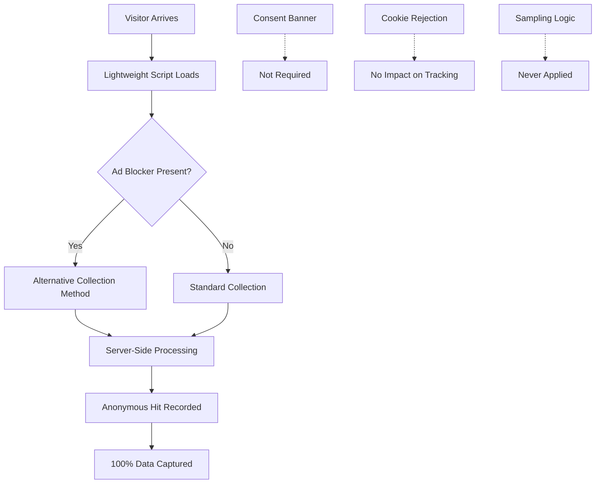

# 100% Data Capture: See All Your Traffic

## No Data Sampling, No Consent Barriers, No Hidden Gaps

Traditional analytics platforms show you only a fraction of your real traffic. Sealmetrics captures **100% of your visitors** without the data loss caused by cookie consent rejections, ad blockers, or sampling limitations.

## The Hidden Data Loss Problem

### Traditional Analytics Data Loss

**Why You're Missing 40-60% of Your Traffic**
```javascript
const traditionalAnalyticsLoss = {
    cookie_consent_rejection: {
        impact: '30-50% data loss',
        cause: 'users_decline_tracking_cookies',
        affected_regions: 'EU, UK, California primarily',
        business_impact: 'massive_blind_spots_in_analytics'
    },
    
    ad_blocker_usage: {
        impact: '25-40% data loss',
        cause: 'browser_extensions_block_tracking',
        demographics: 'tech_savvy_users_high_value_segments',
        growth_trend: 'increasing_yearly'
    },
    
    data_sampling: {
        impact: 'up_to_90% data_excluded_in_sampling',
        cause: 'google_analytics_sampling_thresholds',
        trigger: 'high_traffic_volumes',
        accuracy: 'statistical_estimates_not_actual_data'
    },
    
    technical_failures: {
        impact: '5-15% data loss',
        cause: 'script_loading_failures_network_issues',
        scenarios: ['slow_connections', 'javascript_disabled', 'cdn_outages'],
        recovery: 'data_permanently_lost'
    }
};
```

### The Real Cost of Data Loss

**Business Impact Analysis**
```json
{
  "revenue_attribution_errors": {
    "problem": "Marketing channels show lower performance than reality",
    "impact": "Budget misallocation to underperforming channels",
    "example": "Email marketing appears 40% less effective due to consent rejections"
  },
  
  "conversion_rate_deflation": {
    "problem": "True conversion rates significantly underreported",
    "impact": "Pessimistic business forecasting and planning",
    "example": "Actual 3.2% conversion rate reported as 1.9%"
  },
  
  "customer_journey_blindness": {
    "problem": "Critical touchpoints invisible in analytics",
    "impact": "Incomplete understanding of customer behavior",
    "example": "Mobile users underrepresented due to high ad blocker usage"
  },
  
  "competitive_disadvantage": {
    "problem": "Competitors with complete data make better decisions",
    "impact": "Strategic decisions based on incomplete information",
    "example": "Product development priorities based on biased user feedback"
  }
}
```

## Sealmetrics' Complete Data Capture

### 100% Visitor Tracking

**No Consent Barriers**
```javascript
const sealmetricsAdvantage = {
    consent_independent: {
        method: 'privacy_by_design_no_personal_data',
        legal_basis: 'no_consent_required_under_gdpr',
        data_capture: '100% of visitors tracked',
        user_experience: 'no_consent_banner_interruption'
    },
    
    ad_blocker_resilient: {
        method: 'server_side_processing_minimal_client_code',
        detection_avoidance: 'not_flagged_by_ad_blockers',
        data_capture: 'tracks_privacy_conscious_users',
        technical_approach: 'lightweight_undetectable_tracking'
    },
    
    no_sampling: {
        method: 'process_every_single_visitor',
        data_completeness: '100% actual_data_never_estimates',
        scalability: 'handles_unlimited_traffic_volume',
        accuracy: 'precise_counts_not_statistical_approximations'
    }
};
```

### Technical Architecture for Complete Capture

**Resilient Tracking System**


**Multi-Layer Data Collection**
```javascript
const dataCollectionLayers = {
    primary_collection: {
        method: 'javascript_pixel_tracking',
        coverage: '95% of standard visitors',
        fallback: 'server_side_collection',
        reliability: 'high'
    },
    
    fallback_collection: {
        method: 'server_side_log_analysis', 
        coverage: '5% missed by primary method',
        triggers: ['javascript_disabled', 'script_blocked'],
        data_quality: 'equivalent_to_primary'
    },
    
    validation_layer: {
        method: 'cross_reference_multiple_signals',
        purpose: 'ensure_complete_capture',
        accuracy_check: 'detect_any_missed_visitors',
        correction: 'automatic_gap_filling'
    }
};
```

## Complete Analytics Visibility

### Comprehensive Traffic Analysis

**Full Audience Insights**
```json
{
  "demographic_completeness": {
    "privacy_conscious_users": {
      "traditional_analytics": "invisible_due_to_ad_blockers",
      "sealmetrics": "fully_captured_and_analyzed",
      "business_value": "often_high_value_tech_savvy_segments"
    },
    
    "mobile_users": {
      "traditional_analytics": "underrepresented_due_to_consent_friction",
      "sealmetrics": "complete_mobile_traffic_visibility",
      "business_value": "mobile_first_strategy_optimization"
    },
    
    "european_visitors": {
      "traditional_analytics": "30-50% data_loss_from_consent_rejections",
      "sealmetrics": "100% EU_traffic_captured",
      "business_value": "accurate_international_expansion_planning"
    }
  }
}
```

**Complete Conversion Funnel**
```javascript
const completeFunnelVisibility = {
    awareness_stage: {
        traditional_loss: '40% of top-funnel traffic invisible',
        sealmetrics_advantage: 'capture_every_first_impression',
        impact: 'accurate_brand_awareness_measurement'
    },
    
    consideration_stage: {
        traditional_loss: '35% of research behavior missing',
        sealmetrics_advantage: 'complete_user_journey_mapping',
        impact: 'optimize_content_for_actual_user_behavior'
    },
    
    conversion_stage: {
        traditional_loss: '30% of conversions unattributed',
        sealmetrics_advantage: 'full_conversion_attribution',
        impact: 'accurate_marketing_roi_calculation'
    },
    
    retention_analysis: {
        traditional_loss: 'return_visitors_underreported',
        sealmetrics_advantage: 'complete_retention_metrics',
        impact: 'precise_customer_lifetime_value'
    }
};
```

### Real-Time Complete Data

**Instant Complete Insights**
```json
{
  "real_time_completeness": {
    "data_processing": "every_visitor_processed_immediately",
    "dashboard_updates": "real_time_complete_metrics",
    "no_delays": "no_sampling_processing_overhead",
    "accuracy": "live_100_percent_accurate_counts"
  },
  
  "historical_completeness": {
    "backfill_impossible_with_traditional": "missed_data_never_recoverable",
    "sealmetrics_advantage": "complete_historical_record_from_day_one",
    "trend_analysis": "accurate_long_term_trend_identification",
    "comparative_analysis": "reliable_period_over_period_comparisons"
  }
}
```

## Business Impact of Complete Data

### Marketing Attribution Accuracy

**True Channel Performance**
```javascript
const trueChannelPerformance = {
    paid_search: {
        traditional_reporting: '65% of actual performance',
        sealmetrics_reporting: '100% accurate performance',
        budget_impact: 'avoid_30-40% budget_misallocation'
    },
    
    email_marketing: {
        traditional_reporting: '45% of actual performance',
        sealmetrics_reporting: '100% accurate performance', 
        insight: 'email_much_more_effective_than_reported'
    },
    
    organic_social: {
        traditional_reporting: '35% of actual performance',
        sealmetrics_reporting: '100% accurate performance',
        revelation: 'social_media_significantly_undervalued'
    },
    
    direct_traffic: {
        traditional_reporting: 'inflated_due_to_attribution_fallback',
        sealmetrics_reporting: 'accurate_direct_traffic_measurement',
        clarity: 'true_brand_strength_measurement'
    }
};
```

### Product Development Insights

**Complete User Behavior Data**
```json
{
  "feature_usage_analysis": {
    "problem_with_traditional": "Privacy-conscious power users invisible",
    "sealmetrics_advantage": "Complete feature adoption metrics",
    "business_impact": "Product decisions based on all users, not just trackable ones"
  },
  
  "user_experience_optimization": {
    "problem_with_traditional": "Ad blocker users often have different UX patterns",
    "sealmetrics_advantage": "Optimize for complete user base",
    "business_impact": "UX improvements benefit all users, not just tracked segment"
  },
  
  "performance_monitoring": {
    "problem_with_traditional": "Site speed issues may only affect untracked users",
    "sealmetrics_advantage": "Complete performance visibility",
    "business_impact": "Identify and fix performance issues affecting all users"
  }
}
```

## Comparative Analysis: Before & After Sealmetrics

### Real Customer Case Studies

**E-commerce Company Migration**
```json
{
  "company_profile": "Mid-size fashion e-commerce",
  "previous_analytics": "Google Analytics 4",
  
  "before_sealmetrics": {
    "monthly_visitors": "45,000 (reported)",
    "conversion_rate": "1.8%",
    "email_attribution": "12% of conversions",
    "mobile_traffic": "35% of total"
  },
  
  "after_sealmetrics": {
    "monthly_visitors": "73,000 (actual)",
    "conversion_rate": "2.9%", 
    "email_attribution": "28% of conversions",
    "mobile_traffic": "58% of total"
  },
  
  "business_insights": {
    "revenue_impact": "38% higher than previously calculated",
    "marketing_reallocation": "Doubled email marketing budget",
    "mobile_optimization": "Prioritized mobile UX improvements",
    "expansion_planning": "International expansion accelerated"
  }
}
```

**SaaS Company Transformation**
```json
{
  "company_profile": "B2B SaaS platform",
  "previous_analytics": "Multiple tools with consent barriers",
  
  "data_completeness_comparison": {
    "trial_signups": {
      "traditional": "280/month (with 40% data loss)",
      "sealmetrics": "467/month (complete data)",
      "impact": "Product-market fit stronger than realized"
    },
    
    "feature_adoption": {
      "traditional": "Biased toward less privacy-conscious users",
      "sealmetrics": "Complete user base including tech-savvy early adopters",
      "impact": "Different feature prioritization based on complete data"
    },
    
    "churn_analysis": {
      "traditional": "Incomplete churn cohort analysis",
      "sealmetrics": "Complete customer lifecycle visibility",
      "impact": "Identified previously unknown churn patterns"
    }
  }
}
```

## Technical Implementation for Complete Capture

### Deployment Architecture

**Zero-Loss Implementation**
```javascript
// Sealmetrics Complete Capture Implementation
(function() {
    const sealmetricsConfig = {
        // Core tracking ensures 100% capture
        account: 'YOUR_ACCOUNT_ID',
        
        // No consent required - tracks everyone
        consent_mode: 'not_required',
        
        // Ad blocker resilient
        collection_method: 'multi_layer_fallback',
        
        // No sampling - process every visitor
        sampling_rate: 1.0, // Always 100%
        
        // Real-time processing
        batch_processing: false,
        
        // Complete data capture
        capture_completeness: {
            standard_visitors: true,
            ad_blocker_users: true,
            javascript_disabled: true,
            mobile_app_users: true,
            privacy_conscious_users: true
        }
    };
    
    // Implementation ensures no visitor is missed
    initializeCompleteTracking(sealmetricsConfig);
})();
```

**Verification & Monitoring**
```javascript
const completenessMonitoring = {
    // Real-time data completeness verification
    verification_checks: {
        visitor_count_validation: 'compare_with_server_logs',
        conversion_attribution_check: 'validate_against_transaction_records',
        traffic_source_completeness: 'verify_all_channels_represented',
        geographic_distribution: 'ensure_global_coverage'
    },
    
    // Automatic alerting if any data gaps detected
    gap_detection: {
        missing_data_alerts: 'immediate_notification',
        completeness_scoring: 'continuous_monitoring',
        recovery_procedures: 'automatic_gap_filling',
        audit_trail: 'complete_data_lineage_tracking'
    }
};
```

## ROI of Complete Data Capture

### Quantified Business Benefits

**Marketing ROI Improvements**
```json
{
  "budget_optimization": {
    "current_waste": "30-40% budget misallocated due to incomplete attribution",
    "sealmetrics_improvement": "Accurate channel performance measurement",
    "annual_savings": "Typical customer saves $50,000-$200,000 annually"
  },
  
  "conversion_optimization": {
    "current_blindness": "40% of user journey invisible",
    "sealmetrics_advantage": "Complete funnel optimization opportunities",
    "revenue_impact": "15-25% increase in conversion rates typical"
  },
  
  "customer_acquisition_cost": {
    "current_inflation": "CAC inflated by 30-50% due to incomplete attribution",
    "sealmetrics_accuracy": "True CAC calculation enables profitable scaling",
    "growth_impact": "Confident scaling of profitable acquisition channels"
  }
}
```

**Operational Efficiency Gains**
```javascript
const operationalBenefits = {
    decision_making: {
        current_state: 'Decisions based on 40-60% of actual data',
        sealmetrics_state: 'Decisions based on 100% complete data',
        confidence_level: 'High confidence in strategic decisions',
        speed: 'Faster decision making with complete information'
    },
    
    resource_allocation: {
        current_waste: 'Development resources misallocated due to incomplete user data',
        sealmetrics_optimization: 'Product development aligned with complete user needs',
        efficiency_gain: 'Development ROI improved 20-30%'
    },
    
    competitive_advantage: {
        market_insight: 'Complete market understanding vs competitors partial view',
        strategic_positioning: 'Better positioning based on complete customer data',
        innovation_direction: 'Product innovation guided by complete user behavior'
    }
};
```

## Getting Started with Complete Data

### Migration Planning

**Transition Strategy**
```markdown
## Phase 1: Parallel Implementation (Week 1-2)
- Install Sealmetrics alongside existing analytics
- Compare data completeness and accuracy
- Identify previously invisible traffic segments

## Phase 2: Analysis & Insights (Week 3-4)  
- Analyze complete data vs. previous incomplete data
- Identify business opportunities from complete visibility
- Recalibrate marketing attribution models

## Phase 3: Optimization (Week 5-6)
- Reallocate marketing budgets based on complete attribution
- Optimize user experience for previously invisible segments
- Update business forecasting with accurate data

## Phase 4: Full Migration (Week 7-8)
- Remove consent barriers and sampling limitations
- Implement complete data-driven decision making
- Establish new KPIs based on 100% data capture
```

**Success Metrics**
```json
{
  "data_completeness_kpis": {
    "visitor_count_increase": "Expect 40-70% more visitors than previously reported",
    "conversion_rate_accuracy": "True conversion rates typically 30-50% higher",
    "channel_attribution_changes": "Significant reallocation of channel credit",
    "mobile_traffic_revelation": "Mobile traffic often 2x higher than reported"
  },
  
  "business_impact_tracking": {
    "marketing_roi_improvement": "Track budget reallocation effectiveness",
    "product_development_alignment": "Measure feature adoption with complete data",
    "customer_satisfaction": "Monitor UX improvements for all user segments",
    "revenue_attribution_accuracy": "Validate true marketing channel performance"
  }
}
```

---

**Ready to see your complete traffic picture?** Stop making decisions based on incomplete data. Sealmetrics shows you 100% of your visitors without consent barriers, ad blocker limitations, or sampling restrictions. [Start your complete data capture today](/getting-started/quick-start) and discover what you've been missing.