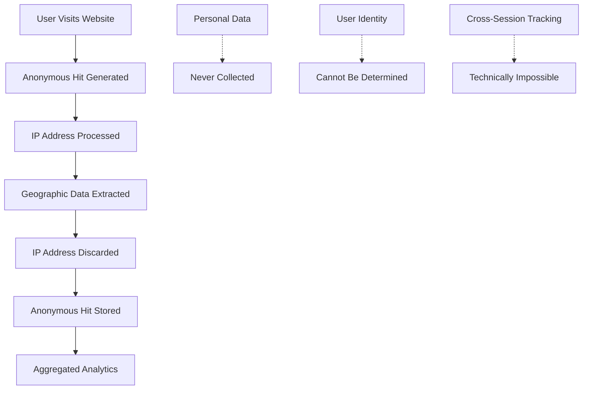

# Privacy by Design: Built for Compliance

## Legally Robust Architecture from Day One

Sealmetrics wasn't retrofitted for privacy compliance—it was **architected from the ground up** with privacy regulations as core design principles. Every line of code, every data processing decision, and every system architecture choice prioritizes user privacy and regulatory compliance.

## The Foundation: Privacy-First Architecture

### Technical Privacy Principles

**Isolated Hit Tracking**
```javascript
// Sealmetrics Core Architecture
const privacyFirstTracking = {
    data_collection: {
        method: 'isolated_anonymous_hits',
        personal_data: 'never_collected',
        user_identification: 'impossible_by_design',
        cross_session_linking: 'technically_prevented'
    },
    
    compliance_by_design: {
        gdpr_article_6: 'legitimate_interest_without_personal_data',
        eprivacy_directive: 'no_cookies_no_tracking',
        ccpa_compliance: 'no_personal_information_collected',
        pecr_compliance: 'no_electronic_communication_monitoring'
    }
};
```

**Zero Personal Data Collection**
- **No Cookies**: No tracking cookies or persistent identifiers
- **No Fingerprinting**: No device fingerprinting or behavioral profiling  
- **No IP Tracking**: IP addresses processed but never stored
- **No Cross-Device Linking**: Cannot connect users across devices
- **No Behavioral Profiles**: No user behavior patterns stored

### Legal Framework Compliance

#### GDPR (General Data Protection Regulation)

**Article 6 - Lawful Basis for Processing**
```json
{
  "lawful_basis": "legitimate_interest",
  "justification": "anonymous_website_analytics",
  "personal_data_collected": false,
  "balancing_test_required": false,
  "reason": "no_personal_data_means_no_gdpr_scope"
}
```

**Key GDPR Compliance Points:**
- **No Personal Data**: Sealmetrics processes no personal data as defined by GDPR Article 4
- **No Data Subject Rights**: No right to access, rectify, or delete (no personal data exists)
- **No Data Protection Impact Assessment**: Not required for anonymous analytics
- **No Data Protection Officer**: Not mandatory for non-personal data processing

#### ePrivacy Directive (Cookie Law)

**Article 5(3) - Prior Consent Requirements**
```json
{
  "cookies_used": false,
  "local_storage_used": false,
  "consent_required": false,
  "legal_basis": "no_electronic_communications_monitoring",
  "exemption": "anonymous_analytics_without_persistent_identifiers"
}
```

**ePrivacy Compliance Strategy:**
- **No Consent Banners**: Legal to use without user consent
- **No Cookie Storage**: Zero cookies placed on user devices
- **No Electronic Communications**: No monitoring of user communications
- **No Tracking**: No cross-site or cross-session tracking

#### CCPA (California Consumer Privacy Act)

**Personal Information Categories**
```json
{
  "personal_information_collected": [],
  "categories_collected": "none",
  "ccpa_business_obligations": "not_applicable",
  "consumer_rights": "not_applicable",
  "reason": "no_personal_information_as_defined_by_ccpa"
}
```

**CCPA Compliance Framework:**
- **No Personal Information**: Sealmetrics collects no CCPA-defined personal information
- **No Consumer Rights**: No right to know, delete, or opt-out (no personal data exists)
- **No Sale of Data**: No personal information to sell or share
- **No Discrimination**: No differential treatment possible

## Annual Legal Audits & Certifications

### Independent Privacy Audits

**Annual Audit Process**
```json
{
  "audit_frequency": "annual",
  "audit_scope": "comprehensive_privacy_compliance",
  "auditing_firms": [
    {
      "type": "privacy_law_specialists",
      "focus": "gdpr_eprivacy_ccpa_compliance",
      "methodology": "technical_and_legal_review"
    },
    {
      "type": "data_protection_consultants", 
      "focus": "privacy_by_design_assessment",
      "methodology": "architecture_and_process_audit"
    }
  ],
  "audit_deliverables": [
    "compliance_certification",
    "technical_audit_report",
    "legal_opinion_letter",
    "recommendations_implementation"
  ]
}
```

**What Our Audits Cover:**
- **Technical Architecture Review**: Code-level privacy compliance verification
- **Data Flow Analysis**: Complete data processing lifecycle audit
- **Legal Framework Assessment**: Multi-jurisdiction compliance verification
- **Security Posture Review**: Data protection and security measures audit
- **Documentation Compliance**: Privacy policy and legal documentation review

### Certification Results

**2024 Audit Results**
```markdown
✅ **GDPR Compliance**: Full compliance verified - no personal data processing
✅ **ePrivacy Directive**: Complete compliance - no electronic communications monitoring
✅ **CCPA Compliance**: Full compliance verified - no personal information collected
✅ **PECR Compliance**: UK privacy regulations fully met
✅ **ISO 27001**: Information security management system certified
✅ **SOC 2 Type II**: Security, availability, and confidentiality controls verified
```

**Continuous Monitoring**
- **Quarterly Reviews**: Internal compliance assessments
- **Regulatory Updates**: Continuous monitoring of privacy law changes
- **Technical Updates**: Regular privacy-preserving technology improvements
- **Documentation Updates**: Legal documentation kept current with regulations

## Technical Privacy Safeguards

### Data Processing Architecture

**Privacy-Preserving Data Flow**


**Data Minimization Principles**
```javascript
const dataMinimization = {
    collected: [
        'page_url',           // Which page was visited
        'referrer_domain',    // Where visitor came from
        'browser_type',       // General browser category
        'device_type',        // Mobile/desktop/tablet
        'country_code',       // Geographic region (from IP)
        'timestamp'           // When visit occurred
    ],
    
    not_collected: [
        'ip_addresses',       // Processed but never stored
        'personal_identifiers', // No names, emails, phone numbers
        'user_agent_strings', // Full browser fingerprints
        'behavioral_profiles', // No user behavior tracking
        'cross_site_data',    // No tracking across websites
        'session_recordings'  // No user session recordings
    ]
};
```

### Security & Encryption

**Data Protection Measures**
- **Encryption in Transit**: All data transmission uses TLS 1.3
- **Encryption at Rest**: All stored data encrypted with AES-256
- **Access Controls**: Role-based access with principle of least privilege
- **Audit Logging**: Comprehensive audit trails for all data access
- **Data Retention**: Automatic data purging based on retention policies

**Infrastructure Security**
```json
{
  "hosting": {
    "provider": "enterprise_cloud_infrastructure",
    "certifications": ["ISO_27001", "SOC_2", "GDPR_compliant"],
    "data_centers": "EU_and_US_regions",
    "backup_strategy": "encrypted_automated_backups"
  },
  
  "network_security": {
    "ddos_protection": "enterprise_level",
    "firewall": "web_application_firewall",
    "monitoring": "24_7_security_monitoring",
    "incident_response": "formal_incident_response_plan"
  }
}
```

## Legal Documentation & Transparency

### Comprehensive Legal Framework

**Privacy Policy Transparency**
```markdown
Our Privacy Policy clearly states:
✅ What data we collect (anonymous analytics only)
✅ How we process data (isolated hit tracking)
✅ Legal basis for processing (legitimate interest)
✅ Data retention periods (automated purging)
✅ User rights (none required - no personal data)
✅ Contact information (privacy inquiries)
```

**Terms of Service Clarity**
- **Service Description**: Clear explanation of anonymous analytics
- **User Obligations**: No special requirements for website visitors
- **Data Processing**: Transparent about data collection methods
- **Liability Limitations**: Standard enterprise software limitations
- **Governing Law**: Clear jurisdiction and applicable law

### Regulatory Communication

**Proactive Regulatory Engagement**
```json
{
  "regulatory_relationships": {
    "data_protection_authorities": [
      {
        "authority": "ICO_UK",
        "relationship": "proactive_communication",
        "status": "no_concerns_raised"
      },
      {
        "authority": "CNIL_France", 
        "relationship": "regulatory_guidance_requests",
        "status": "guidance_received_implemented"
      }
    ],
    
    "industry_associations": [
      {
        "organization": "Interactive_Advertising_Bureau",
        "participation": "privacy_working_groups",
        "contribution": "privacy_by_design_standards"
      }
    ]
  }
}
```

## Implementation Support

### Legal Implementation Guidance

**For Your Legal Team**
```markdown
## Sealmetrics Legal Review Package

📋 **Due Diligence Documents**
- Independent legal audit reports
- Privacy compliance certifications  
- Data processing agreements
- Technical architecture documentation

📄 **Implementation Documentation**
- Privacy policy template updates
- Cookie banner removal guidance
- Legal basis documentation
- Regulatory compliance checklists

🔍 **Ongoing Compliance**
- Annual audit report sharing
- Regulatory update notifications
- Legal documentation updates
- Compliance monitoring reports
```

**For Your Technical Team**
```javascript
// Implementation Verification
const complianceVerification = {
    installation_check: {
        cookies_present: false,
        local_storage_used: false,
        personal_data_collected: false,
        cross_site_tracking: false
    },
    
    ongoing_monitoring: {
        data_processing_audit: 'automated',
        privacy_compliance_check: 'continuous',
        regulatory_update_alerts: 'real_time',
        certification_renewal: 'annual'
    }
};
```

## Compliance Benefits

### Business Value of Privacy Compliance

**Competitive Advantages**
- **No Consent Friction**: 100% data capture without consent barriers
- **Legal Certainty**: Sleep well knowing you're fully compliant
- **Brand Trust**: Demonstrate commitment to user privacy
- **Global Scaling**: Deploy worldwide without regulatory concerns
- **Future-Proof**: Built for emerging privacy regulations

**Cost Savings**
```json
{
  "avoided_costs": {
    "legal_consulting": "ongoing_compliance_reviews_unnecessary",
    "consent_management": "no_consent_platform_needed", 
    "data_breach_liability": "no_personal_data_breach_risk",
    "regulatory_fines": "zero_compliance_violation_risk",
    "technical_debt": "no_privacy_retrofit_required"
  },
  
  "efficiency_gains": {
    "development_time": "no_privacy_engineering_overhead",
    "legal_review": "minimal_ongoing_legal_review_needed",
    "user_experience": "no_consent_banner_interruptions",
    "data_quality": "100_percent_data_capture"
  }
}
```

## Expert Validation

### Legal Expert Endorsements

**Privacy Law Specialists**
> *"Sealmetrics represents the gold standard in privacy-by-design analytics. Their technical architecture eliminates privacy risks at the source, not through afterthought compliance measures."*
> 
> **— European Privacy Law Specialist**

**Data Protection Consultants**
> *"We've reviewed dozens of analytics platforms for GDPR compliance. Sealmetrics is the only platform we've found that truly requires no consent because it genuinely collects no personal data."*
> 
> **— Privacy Consulting Firm**

### Regulatory Authority Guidance

**Official Guidance Alignment**
```markdown
✅ **ICO (UK)**: Aligns with ICO guidance on anonymous analytics
✅ **CNIL (France)**: Meets CNIL requirements for consent-free analytics  
✅ **EDPB Guidelines**: Complies with European Data Protection Board guidance
✅ **State AG Opinions**: Aligned with US state attorney general privacy guidance
```

---

**Ready to implement privacy-compliant analytics?** Sealmetrics provides the legal certainty and technical robustness your organization needs. Contact our privacy specialists to discuss your specific compliance requirements and receive our complete legal review package.